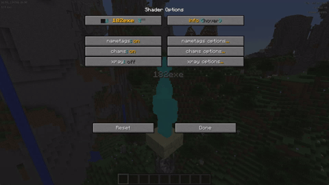

# clairvoyance

an optifine shaderpack with visual hacking modules similar to other popular utility mods/cheat clients.

## features

- chams/esp
- xray
- nametags
- global tinting & rgb effects

## downloads

- soon

## installation

- get and install [optifine](https://optifine.net) for minecraft 1.8.9
- navigate to your `.minecraft` folder (google if you don't know how to find it)
- put your download into the `shaderpacks` directory